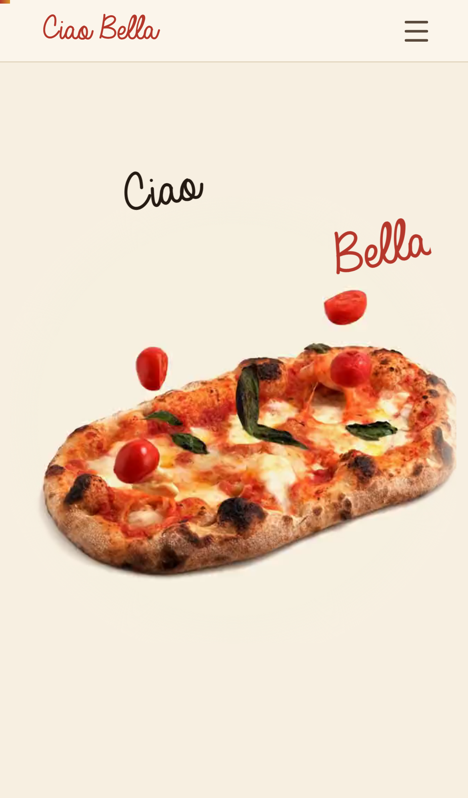

  

  

 

## 🌍 Langages

  

 

## 🕸️ Web

  

 

## ⚙️ Outils & environnements

  

 

## 🔭 Projet du moment

<table>
<tr>
<td width="60%">

### 🍕 Ciao Bella

Site vitrine d'un restaurant-épicerie italien à La Bourboule. Hero vidéo **scrubée au scroll** (la pinsa se décompose sous le doigt), parallax d'ambiance, avis Google rafraîchis à chaque build — export statique Next.js optimisé jusqu'aux téléphones d'entrée de gamme.

**[→ ciao-bella.vercel.app](https://ciao-bella.vercel.app)**

</td>
<td>

</td>
</tr>
</table>

 

## 📬 Me contacter

*Toujours partant pour parler d'un projet.*

  

